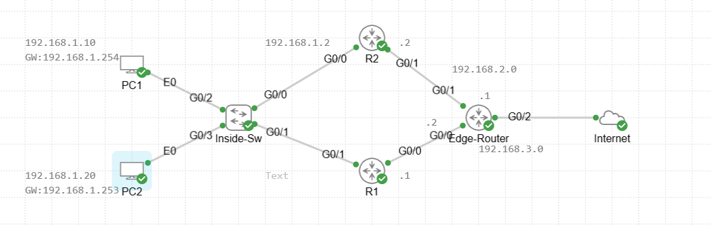

# Configure and Verify HSRP Load Sharing


## Lab Objective
This lab demonstrates how **HSRP load sharing** can be achieved by configuring **multiple HSRP groups with different virtual IP addresses (VIPs)** on the same LAN.

Each HSRP group serves a different default gateway, allowing traffic to be distributed across multiple routers while maintaining redundancy.

---

## Topology Overview


---

## Addressing Summary

| Device | Interface | IP Address |
|------|-----------|------------|
| R1 | G0/1 | 192.168.1.1/24 |
| R2 | G0/0 | 192.168.1.2/24 |
| HSRP Group 1 VIP | — | 192.168.1.253 |
| HSRP Group 2 VIP | — | 192.168.1.254 |
| R1 | G0/0 | 192.168.3.1/24 |
| R2 | G0/1 | 192.168.2.2/24 |
| Edge | G0/0 | 192.168.3.2/24 |
| Edge | G0/1 | 192.168.2.1/24 |

---

## Design Explanation

- **HSRP Group 1**
  - Active Router: R1
  - Virtual IP: 192.168.1.253
  - Used by PC2

- **HSRP Group 2**
  - Active Router: R2
  - Virtual IP: 192.168.1.254
  - Used by PC1

This approach provides **active/active gateway behavior** while preserving failover capabilities.

---

## R1 Configuration (Active for Group 1)

```cisco
interface GigabitEthernet0/1
 ip address 192.168.1.1 255.255.255.0
 standby 1 ip 192.168.1.253
 standby 1 priority 110
 standby 1 preempt
 standby 1 track 1 decrement 20
 standby 2 ip 192.168.1.254
```

```cisco
interface GigabitEthernet0/0
 ip address 192.168.3.1 255.255.255.0
 standby 1 track 1 decrement 20
```

```cisco
ip route 0.0.0.0 0.0.0.0 192.168.3.2
```

---

## R2 Configuration (Active for Group 2)

```cisco
interface GigabitEthernet0/0
 ip address 192.168.1.2 255.255.255.0
 standby 1 ip 192.168.1.253
 standby 2 ip 192.168.1.254
 standby 2 priority 110
 standby 2 preempt
```

```cisco
ip route 0.0.0.0 0.0.0.0 192.168.2.1
```

---

## Edge Router Configuration

```cisco
ip route 192.168.1.0 255.255.255.0 192.168.3.1 track 1
ip route 192.168.1.0 255.255.255.0 192.168.2.2 track 2
```

```cisco
ip sla 1
 icmp-echo 192.168.3.1 source-interface GigabitEthernet0/0
 frequency 5

ip sla 2
 icmp-echo 192.168.2.2 source-interface GigabitEthernet0/1
 frequency 5
```

---

## PC Configuration

### PC1 (Uses R2)
```bash
ip addr add 192.168.1.10/24 dev eth0
ip link set eth0 up
ip route add default via 192.168.1.254
```

### PC2 (Uses R1)
```bash
ip addr add 192.168.1.20/24 dev eth0
ip link set eth0 up
ip route add default via 192.168.1.253
```

---

## Verification Commands

```cisco
show standby brief
show standby
show ip route
show track
show ip sla statistics
```

---

## Validation Scenarios

1. Shut R1 uplink → PC2 fails over
2. Shut R2 uplink → PC1 fails over
3. Restore links → Load sharing resumes

---

## Key Takeaways

- HSRP supports load sharing using multiple groups
- Different VIPs allow traffic distribution
- Tracking improves resiliency
- Edge routing must align with HSRP behavior

---

_End of Lab_
