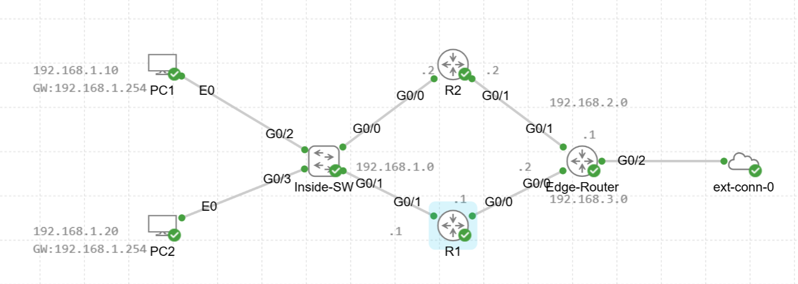

# Configure and Verify Virtual Router Redundancy Protocol (VRRP)

## Lab objective
Implement and validate **VRRP** as a first-hop redundancy protocol (FHRP) for an enterprise LAN gateway, and confirm failover behavior when the master router loses the LAN interface.

---

## Quick notes (VRRP vs HSRP)
- **VRRP** is an **open standard** alternative to **HSRP**.
- VRRP uses **Master/Backup** roles (similar to Active/Standby).
- VRRP multicast destination: **224.0.0.18**
- VRRP virtual MAC format: **0000.5e00.01XX** (XX = VRID in hex)
- **Preemption is enabled by default** in VRRP (unlike HSRP where you configure `standby <grp> preempt`).
- The **virtual IP can be the same as a real IP** (common VRRP design option).
- Highest priority wins. Priority range is typically **1–254**; **255** is reserved for the router that *owns* the virtual IP (when using “IP address owner” behavior).

---

## Topology



---

## Addressing

| Node | Interface | IP |
|---|---|---|
| R1 | G0/1 (LAN) | 192.168.1.1/24 |
| R2 | G0/0 (LAN) | 192.168.1.2/24 |
| VRRP VIP | VRID 1 | 192.168.1.254 |
| R1 | G0/0 | 192.168.3.1/24 |
| R2 | G0/1 | 192.168.2.2/24 |
| Edge | G0/0 | 192.168.3.2/24 |
| Edge | G0/1 | 192.168.2.1/24 |
| PCs | eth0 | 192.168.1.10 / 192.168.1.20 |

---

## Design
- VRRP runs on the **LAN segment (192.168.1.0/24)** using **VRID 1** and VIP **192.168.1.254**.
- **R1** is preferred Master using a higher priority (**110**) than **R2** (default **100** if not set).
- PCs use **192.168.1.254** as their default gateway.
- Edge router uses **IP SLA + tracked routes** so return traffic follows the currently reachable path


## Configurations

### R1 (preferred Master)

```cisco
interface GigabitEthernet0/0
 ip address 192.168.3.1 255.255.255.0

interface GigabitEthernet0/1
 ip address 192.168.1.1 255.255.255.0
 no shutdown
 vrrp 1 ip 192.168.1.254
 vrrp 1 priority 110
 vrrp 1 authentication abc

ip route 0.0.0.0 0.0.0.0 192.168.3.2
```

### R2 (backup)

```cisco
interface GigabitEthernet0/0
 ip address 192.168.1.2 255.255.255.0
 vrrp 1 ip 192.168.1.254
 vrrp 1 authentication abc

interface GigabitEthernet0/1
 ip address 192.168.2.2 255.255.255.0

ip route 0.0.0.0 0.0.0.0 192.168.2.1
```

### Edge Router (tracked return paths)

```cisco
interface GigabitEthernet0/0
 ip address 192.168.3.2 255.255.255.0
 ip nat inside

interface GigabitEthernet0/1
 ip address 192.168.2.1 255.255.255.0
 ip nat inside

interface GigabitEthernet0/2
 ip address dhcp
 ip nat outside

access-list 1 permit 192.168.1.0 0.0.0.255
ip nat inside source list 1 interface GigabitEthernet0/2 overload

ip route 192.168.1.0 255.255.255.0 192.168.3.1 track 1
ip route 192.168.1.0 255.255.255.0 192.168.2.2 track 2

ip sla 1
 icmp-echo 192.168.3.1 source-interface GigabitEthernet0/0
 frequency 5
ip sla schedule 1 life forever start-time now

ip sla 2
 icmp-echo 192.168.2.2 source-interface GigabitEthernet0/1
 frequency 5
ip sla schedule 2 life forever start-time now

track 1 ip sla 1 reachability
track 2 ip sla 2 reachability
```

---

## PC configuration (TinyLinux desktop)

### PC1
```bash
sudo ip addr add 192.168.1.10/24 dev eth0
sudo ip link set eth0 up
sudo ip route add default via 192.168.1.254
```

### PC2
```bash
sudo ip addr add 192.168.1.20/24 dev eth0
sudo ip link set eth0 up
sudo ip route add default via 192.168.1.254
```

---

## Verification

### On R1 / R2
```cisco
show vrrp brief
show vrrp
show ip interface brief
show ip route
```

What to confirm:
- One router is **Master** for VRID 1
- The other router is **Backup**
- VIP **192.168.1.254** is present
- MAC address follows **0000.5e00.01XX**

### On PCs
```bash
ping 192.168.1.254
ping 8.8.8.8
```

---

## Test scenarios (failover)

### Scenario 1 – Fail LAN interface on Master
1. On R1:
   ```cisco
   interface g0/1
    shutdown
   ```
2. Expected:
   - R2 becomes **Master**
   - PC1 and PC2 keep internet access via VIP

3. Restore:
   ```cisco
   interface g0/1
    no shutdown
   ```
4. Expected:
   - R1 takes back Master role (preemption is default) if priority is higher

---

## Key takeaways
- VRRP is a strong **open standard** alternative to HSRP.
- Master/Backup roles and multicast behavior are easy to validate with `show vrrp`.
- Preemption default behavior is important to remember when designing predictable failover.
- Always ensure your LAN interface is **up** and not administratively shut.

---

_End of lab_
